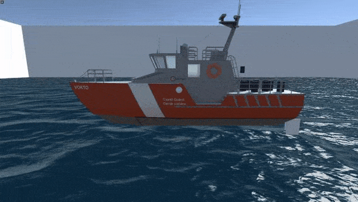

# Water interaction model for Unity
Available soon in the Asset Store...

	English |
	<a href="./readme/README-rus.md">Pусский</a>

## Sections
* [What is this?](#what-is-this)
* [Effects that are implemented](#effects-that-are-implemented)
* [Requirements](#requirements)
* [Sources](#sources)

## What is this?
This is an asset with component (BuoyancyComponent) that allows target gameobjects to floating
## Effects that are implemented

#### Pushing out 

#### Lift when moving

#### Controlled drift on turn

#### Wave rolling and stabilization

#### Also drag forces:
* Air drag force
* Viscous fluid resistance

## Requirements
* Unity engine 2018.4.0 and older
* Water function that allow to find distance between any point and water surface
* Low polygonal mesh for gameobjects for which you want allow to floating

## Sources
Project was started as diploma bachelor's work (Russian language). [Find the work here](http://biblioclub.ru/index.php?page=book_red&id=561383&sr=1)

#### Used projects
Gameobjects for demo scene and water function were taken from: Fast Buoyancy // Unity. – 2017. – URL: https://assetstore.unity.com/packages/tools/physics/fast-buoyancy-61079 (visited on 18.05.2019).

#### Articles and books
The work was based on (sorted in order of contribution to work):

English (1,2 are good to get fast understanding how does it work):
1. Kerner J. Water interaction model for boats in video games // GAMASUTRA. – 2015. – URL: https://gamasutra.com/view/news/237528/Water_interaction_model_for_boats_in_video_games.php (visited on 09.04.2019)
2. Kerner J. Water interaction model for boats in video games part 2 // GAMASUTRA. – 2016. – URL: http://www.gamasutra.com/view/news/263237/Water_interaction_model_for_boats_in_video_games_Part_2.php (visited on 13.04.2019)
3. Bourg D., Bywalec B. Physics for Game Developers, Second Edition. – Sebastopol: O’Reilly Media, 2013. – 551 p.
4. Palmer G. Physics for Game Programmers. – New York.: Springer-Verlag, 2005. – 444 p.

Russian:
1. Басин А.М., Анфимов В.Н. Гидродинамика судна. – Ленинград: Издательство «Речной транспорт», 1961. – 684 p.
2. Новака Г.М. Справочник по катерам, лодкам и моторам. – Ленинград: Судостроение, 1982. – 352 p.
