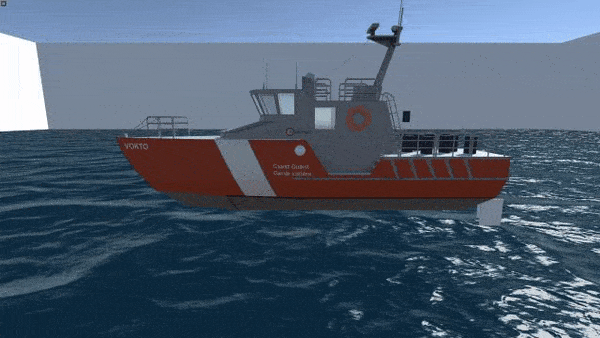

# Water interaction model for Unity
Available soon in the Asset Store...

	<a href="../README.md">English</a> |
  	Pусский

## Содержание
* [О чем проект?](#о-чем-проект)
* [Реализованные эффекты](#реализованные-эффекты)
* [Требования](#требования)
* [Источники](#источники)

## О чем проект?
Данное решение является ассетом игрового движка Unity, который содержит компонент (BuoyancyComponent). Данный компонент позволяет определенным игровым объектам реалистично взаимодействовать с водой 

## Реализованные эффекты

|||
|:---|---:|
| Выталкивание тела из воды | | 
|  | |
|||
| Подъемные силы при движении | |
|  |  |
|||
| Контролируемый снос судна при повороте | | 
|  | |
|||
| Качка на волнах и стабилизация судна | |
|  |  |

#### Также реализованы силы сопротивления:
* Сопротивление воздуха
* Сопротивление вязкой жидкости

## Требования
* Движок Unity версии 2018.4.0 и старше
* Функция воды (волн), которая позволяет находить высоту любой точки из игрового мира над уровнем воды
* Низкополигональная модель для игровых объектов, к которым добавляется данный компонент

## Источники
Проект был начат как дипломная работа бакалавра (на русском). [Работу можно найти здесь](http://biblioclub.ru/index.php?page=book_red&id=561383&sr=1)

#### Сторонние проекты, которые использовались
Игровые объекты для демо сцены, а также функция воды были взяты из: Fast Buoyancy // Unity. – 2017. – URL: https://assetstore.unity.com/packages/tools/physics/fast-buoyancy-61079 (дата обращения 18.05.2019).

#### Литература
Проект основывается на (отсортировано в порядке вклада в работу):

Источники на английском (1,2 позволяют быстро понять, как работает решение):
1. Kerner J. Water interaction model for boats in video games // GAMASUTRA. – 2015. – URL: https://gamasutra.com/view/news/237528/Water_interaction_model_for_boats_in_video_games.php (дата обращения 09.04.2019) (перевод статьи https://habr.com/ru/post/307362/)
2. Kerner J. Water interaction model for boats in video games part 2 // GAMASUTRA. – 2016. – URL: http://www.gamasutra.com/view/news/263237/Water_interaction_model_for_boats_in_video_games_Part_2.php (дата обращения 13.04.2019) (перевод статьи https://habr.com/ru/post/309036/)
3. Bourg D., Bywalec B. Physics for Game Developers, Second Edition. – Sebastopol: O’Reilly Media, 2013. – 551 с.
4. Palmer G. Physics for Game Programmers. – New York.: Springer-Verlag, 2005. – 444 с.

На русском:
1. Басин А.М., Анфимов В.Н. Гидродинамика судна. – Ленинград: Издательство «Речной транспорт», 1961. – 684 с.
2. Новака Г.М. Справочник по катерам, лодкам и моторам. – Ленинград: Судостроение, 1982. – 352 с.
